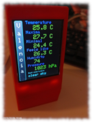
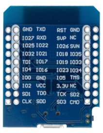

# weather_esp32_clock  

Estacion meteorológica con reloj de escritorio basada en api.openweathermap.org y BME280 para esp32 en Arduino core.

#### Características:

	Reloj basado en NTP con soporte de horario de verano. 
	Datos del clima desde openweathermaps.org.  
	Datos de temperatura, humedad y presión locales desde un sensor BME280.
    Servidor web con WIFI en modo AP para configurar la WIFI.  
	Servidor web para la configuración.
    Datos mostrados.
        Fecha y hora.
        Velocidad y direccion del viento, nombre del viento.
        Hora de amanecer.
        Hora de anochecer.
        Descripcion del clima e icono.
        Temperatura.
        Temperatura máxima.
        Temperatura mínima.
        Sensación térmica.
        Presión atmosférica.
        Humadad relativa.
        Nombre de la localización.
        Calidad del aire, calificación y datos (CO,NO,NO2,O3,NH3,SO2,PM2-5 y PM10)
        Cinco dias de prevision con nombre del dia, hora, temperatura, probabilidad de precipitación y descripción.

#### D1 Mini ESP32 ESP-32:

 

#### Sensor Digital de temperatura, humedad, módulo de presión barométrica, 	BME280 (opcional):

#### Módulo LCD SPI de 2,2 pulgadas, 240x320, ILI9341:

#### Esquema

## Compilación
#### Arduino IDE

    Necesita tener soporte para las placas esp32, mire en https://espressif-docs.readthedocs-hosted.com/projects/arduino-esp32/en/latest/installing.html como relaizar la instalación.  

    -Instalar Git:  
      https://git-scm.com/book/en/v2/Getting-Started-Installing-Git
    -Clonar el repositorio
      Desde el directorio de Arduino ejecutar: git clone https://github.com/josaezlopez/weather_esp32_clock.git
    -Instalar las librerias
      Cambiese al directorio que creó git: cd weather_esp32_clock
        -En linux ejecutar el script make_arduino_ide.sh: sh make_arduino_ide.sh
        -En windows ejecutar el script make_arduino_ide.bat desde el cmd.
            - Instalar las siguientes librerias desde el gestor de librerias del IDE.  
                -ArduinoJson@^6.20.1
	            -Adafruit BME280 Library@^2.2.2
	            -Adafruit Unified Sensor@^1.1.7
                -CRC32@^2.0.0
	            -SPIFFS ImageReader Library@^1.0.0
	            -Adafruit ILI9341@^1.5.14

    -Ejecute el IDE de arduino y abra el sketch weather_esp32_clock.ino.
    -Configure la placa esp32 utilizada y el puerto al que está conectado, elija el esquema de particiones y el nivel de debug como se muestra en la image:
     

#### PlaformIO

Antes de compilar modifique **lib/funcaux/conf.h** para poner el ssid password de su WIFI y la APIKEY de openweathermaps.
Si no tiene instalado el sensor BME280 cambie la directiva **ENABLE_BME280** a false. 
Se usa el apikey gratuito, desde aquí se puede conseguir el apikey: https://openweathermap.org/price.
  
Si se usa platformio se resolverán correctamente todas las dependencias de las librerías.
Existen dos entornos en platformio.ini: release y release_ota. release_ota permite programar el dispositivo por OTA.
Después de compilar y enviar al esp32. Arrancará con la configuración por defecto, para cambiarla puede acceder a **http://wstation.local**
Las coordenadas se pueden pegar desde google maps.

## Funcionamiento
Después de arrancar muestra:

Pantalla numero 1:

    • Temperatura
    • Presión
    • Humedad relativa
    • Descripción e icono.
    • Dirección del viento, nombre (en el mediterráneo) y velocidad
    • Hora del amanecer y anochecer:
    • Reloj con fecha y hora (puede ajustarse a horario de verano/invierno según la configuración)

Con una pulsación en el botón touch pasa a mostrar:

    • Temperatura leída  por el BME280
    • Presión leída  por el BME280
    • Humedad leída por el BME280
    • Descripción e icono
    • Dirección del viento, nombre (en el mediterráneo) y velocidad
    • Hora del amanecer y anochecer:
    • Reloj con fecha y hora.

Con una pulsación en el botón touch pasa a mostrar la calidad del aire:

Pantalla numero 2:

    • Clasificación de la calidad del aire
    • CO (monóxido de carbono)
    • NO (monóxido de nitrógeno)
    • NO2 (dióxido de nitrogeno)
    • O3 (ozono)
    • NH3 Amoniaco
    • SO2 (dióxido de azufre)
    • PM 2-5 (partículas entre 2 y 5 uM
    • PM 10 (partículas de mas de 10uM

Con una pulsación en el botón touch pasa a mostrar los datos generales del tiempo.

Pantalla numero 3:

    • Temperatura
    • Temperatura máxima (ultima 24 horas)
    • Temperatura mínima (ultimas 24 horas)
    • Sensación térmica.
    • Humedad
    • Presión
    • Dirección viento, nombre y velocidad.
    • Descripción clima.

Desde esta pantalla una pulsación corta vuelve a la Pantalla 1 y una larga muestra la previsión del clima en cinco dias.

Dependencias:

	bblanchon/ArduinoJson@^6.20.1
	adafruit/Adafruit BME280 Library@^2.2.2
	adafruit/Adafruit Unified Sensor@^1.1.7
	josaezlopez/threadesp32@^1.0
	josaezlopez/NTPClientExt@^1.0.0
	bakercp/CRC32@^2.0.0
	lucadentella/SPIFFS ImageReader Library@^1.0.0
	adafruit/Adafruit ILI9341@^1.5.14

stl para imprimir la caja
https://cults3d.com/es/modelo-3d/artilugios/caja-para-esp32-esp8266-y-tft-2-2-pulgadas-ili9341-josaezlopez
