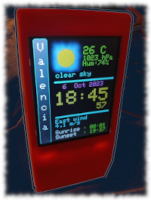
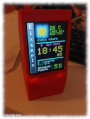
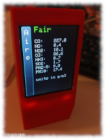
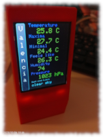
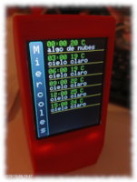
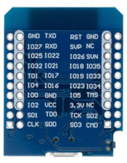

# weather_esp32_clock
[En español](LEEME.md)  
Weather station with desktop clock based on api.openweathermap.org and BME280 for esp32 on Arduino core.

#### Features:
  
    NTP based clock.
    Weather data from openweathermaps.org
    Local temperature, humidity and pressure data from a BME280 sensor.
    Web server for configuration.
    Weather forecast with probability of precipitation, temperature and description. 

#### D1 Mini ESP32 ESP-32:

 

#### Digital Temperature Humidity Sensor Barometric Pressure Module BME280 (opcional):

#### 2.2 inch 240x320 SPI LCD Module ILI9341:

#### Schematic;

## Compilation:

  #### Preparing the SPIFFS file system

The icons are in the data directory. You have to build the file system with what is in that directory and send it to esp32, to do this from the PlatformIO icon→ PROJECT TASK → release→ Platform **click in Erase flash, Build filesystem image y Upload filesystem image**.

Before compiling, modify **conf.h** to set the ssid password of your WIFI and the openweathermaps APIKEY.
If you do not have the BME280 sensor installed change the **ENABLE_BME280** directive to false.
The free apikey is used, you can get the api key from here: https://openweathermap.org/price.

If platformio is used, all library dependencies will be resolved correctly.
platformio.ini comes configured with two environments: release and release_ota. release_ota allows uploading via Wi-Fi.
After compiling and sending to esp32 it will start with the default configuration, to change it you can access **http://wstation.local**  
The coordinates can be pasted from Google Maps.

## Functioning:

After booting it shows:

Screen number 1:

    • Temperature
    • Pressure
    • RH
    • Description and icon.
    • Wind direction, name (in the Mediterranean) and speed
    • Sunrise and sunset time:
    • Clock with date and time (can be set to summer/winter time depending on settings)

With a press on the touch button it shows:

    • Temperature read by the BME280
    • Pressure read by the BME280
    • Humidity read by the BME280
    • Description and icon
    • Wind direction, name (in the Mediterranean) and speed
    • Sunrise and sunset time:
    • Clock with date and time.

With a press on the touch button it starts showing the air quality:

Screen number 2:

    • Air quality classification
    • CO (carbon monoxide)
    • NO (nitrogen monoxide)
    • NO2 (nitrogen dioxide)
    • O3 (ozone)
    • NH3 Ammonia
    • SO2 (sulfur dioxide)
    • PM 2-5 (particles between 2 and 5 uM
    • PM 10 (particles larger than 10uM

By pressing the touch button, it will display the weather general data.  

Screen number 3:

    • Temperature
    • Maximum temperature (last 24 hours)
    • Minimum temperature (last 24 hours)
    • Thermal sensation.
    • Humidity
    • Pressure
    • Wind direction, name and speed.
    • Climate description.

From this screen, a short press returns to Screen 1 and a long press shows the weather forecast for five days.

Dependencies:

 bblanchon/ArduinoJson@^6.20.1  
 adafruit/Adafruit BME280 Library@^2.2.2  
 adafruit/Adafruit Unified Sensor@^1.1.7  
 josaezlopez/threadesp32@^1.0  
 josaezlopez/NTPClientExt@^1.0.0  
 bakercp/CRC32@^2.0.0  
 lucadentella/SPIFFS ImageReader Library@^1.0.0  
 adafruit/Adafruit ILI9341@^1.5.14  

stl for print box:
https://cults3d.com/es/modelo-3d/artilugios/caja-para-esp32-esp8266-y-tft-2-2-pulgadas-ili9341-josaezlopez

